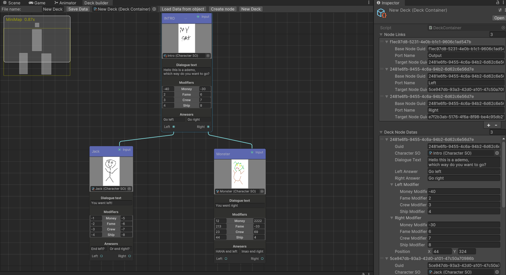

# Card system
### Project description:
This is a training project to create a similar card system to the hit mobile game Reigns. 
I wanted to create a nice Unity tool to visualise creation of stories like behaviour trees. 

# How does it work:
This system uses Unity GraphView tools to create a new window in which a designer can load and save their decks.
It works on ScriptableObjects where each node is it's own object that has references to other nodes it is connected to via ports.
Its structured like a behaviour tree, instead of going left to right like a VisualScripting system it is top-bottom like a behaviour tree.

Each node has a unique guid assigned alongside references to a SO of a character, with fields to display which action it can split into.
Players can go either left or right, with those actions having affect on some stats and the story.

  

# Project structure:
## Graphs
The graph code can be found in the Assets/Editor folder as it uses UnityEditor features.

## Deck Saves
Each Deck is saved as a ScriptableObject under Resources/Decks

## Current UI and Game Code
To display how the deck data can be used in game I added coupld of scripts to manage the "gameplay" under Assets/Code.

# Video Example:

